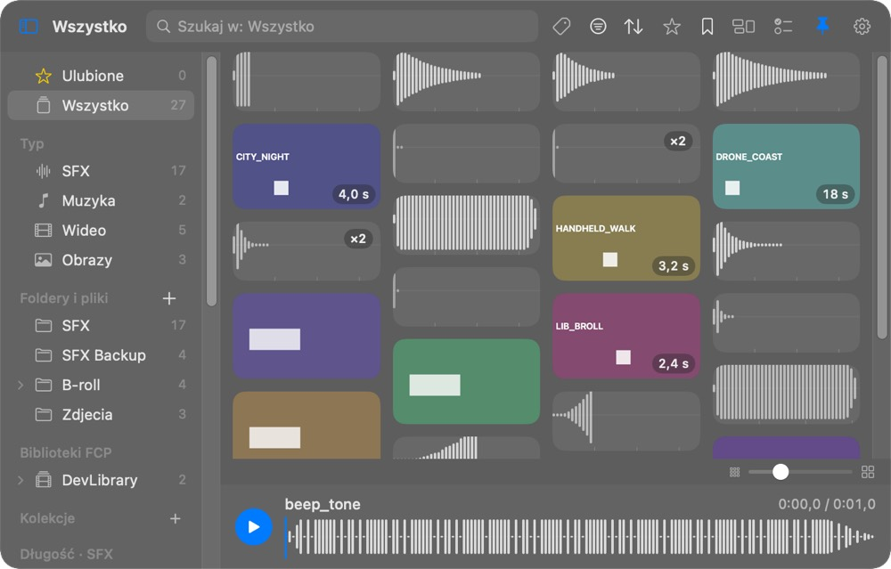
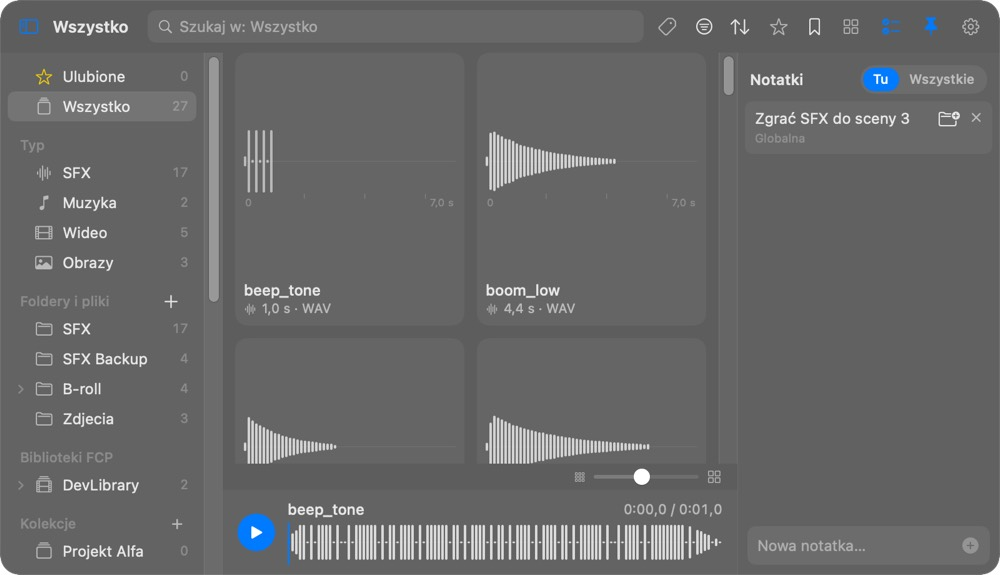
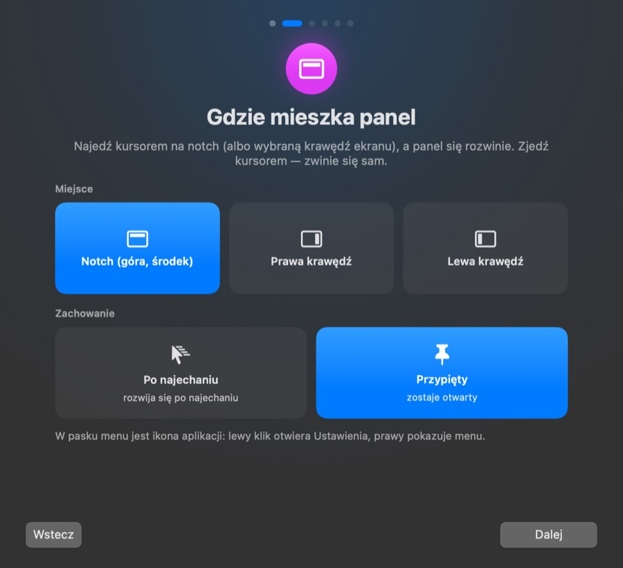
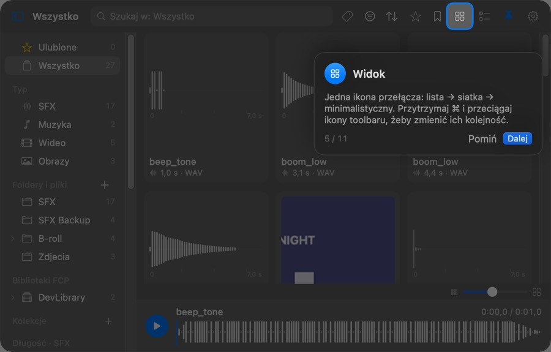

# Handy Hand

Natywny panel dla macOS przy notchu: biblioteka Twoich dźwięków (SFX, muzyka), wideo i obrazów, z której przeciągasz pliki prosto na oś czasu Final Cut Pro. Kierunek: dysk → edytor.

*English:* a native macOS notch-docked media library panel for Final Cut Pro — browse sounds, video and images from disk and drag them onto the timeline. Three view modes (list / grid / minimalist masonry), collections, notes, undo. Local only, no accounts, no network.






- Instrukcja użytkownika: [`docs/Instrukcja.html`](docs/Instrukcja.html)
- Stan prac i lista sprawdzonych / niesprawdzonych rzeczy: [`App/STATUS.md`](App/STATUS.md)

## Układ repozytorium

```
App/                  aplikacja (SwiftPM: DockCore = logika, MidniteDock = interfejs AppKit/SwiftUI, DockCoreTests)
  Resources/          ikona aplikacji i grafiki
  build-app.sh        buduje .app poza iCloudem (~/Library/Caches), podpis ad-hoc
  package.sh          wersja release -> App/dist/Handy Hand.app
  make-dmg.sh         uniwersalny (Apple Silicon + Intel) build -> Handy Hand.dmg (domyślnie ~/Downloads)
  dev-run.sh          uruchomienie na danych testowych (osobny katalog danych)
docs/                 instrukcja użytkownika
```

## Budowanie

Wymagania: macOS 14+, Xcode / Swift 5.9+.

```bash
cd App
swift test --scratch-path ~/Library/Caches/MidniteDockBuild-App   # testy jednostkowe
./package.sh                                                       # App/dist/Handy Hand.app
./make-dmg.sh                                                      # ~/Downloads/Handy Hand.dmg
```

Wewnętrzna nazwa targetu i identyfikator paczki (`MidniteDock`, `com.midnitemedia.midnitedock`) zostały bez zmian, żeby zmiana nazwy produktu nie odcięła istniejących danych (`~/Library/Application Support/MidniteDock`).

## Uwagi

- Podpis ad-hoc (bez konta deweloperskiego Apple): na innych Macach trzeba aplikację raz zatwierdzić w Ustawieniach systemowych (opisane w instrukcji).
- Licencja: [MIT](LICENSE).
